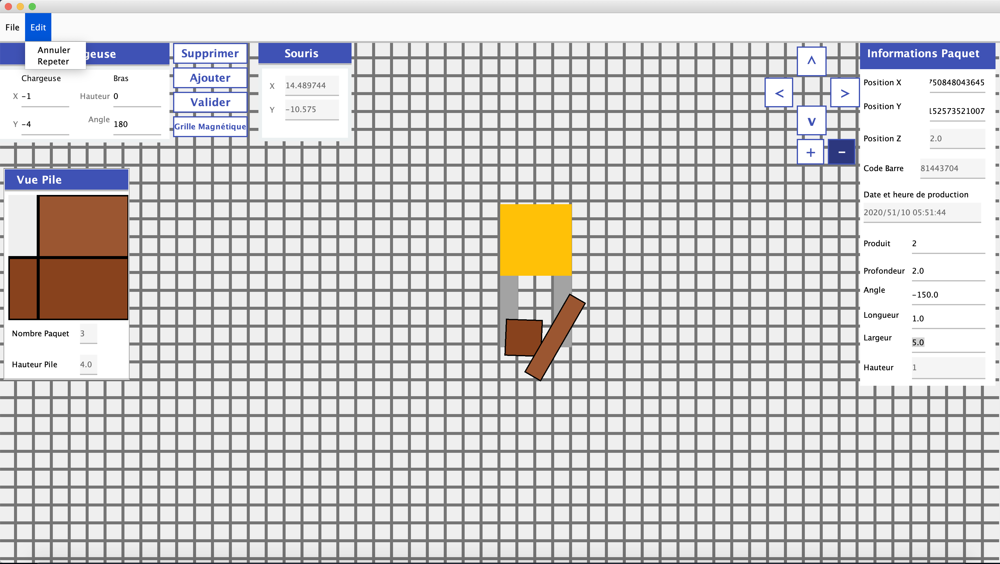

# __Virtubois__ (GLO-2004)

## __Introduction__

This project took place during my exchange program at Laval University (QC) for the class "Génie Logiciel" Object-Oriented. With a group of 3 other students, we had to develop a Java application, following the Unified-process and a code architecture respecting the GRASP concepts.

## __Goal__

The goal of this application was to allow a user to manage a wooden plank storage site. The application should allow the following tasks : 
- Control one Loader controlled with the key Arrow (position, orientation, level of the mechanical arms).
- Create / Suppress, packs of boards with custom height width, product name.
- Navigate/Zoom on the Grid.
- Export the configuration to a 3D file.
- Load / Save the configuration.
- And many other tasks ...

## __Visual__ 

## __User Guide__

- Launch the .jap file
- Control the position of the loader with key Arrow and the height of the arms with O and P key.
